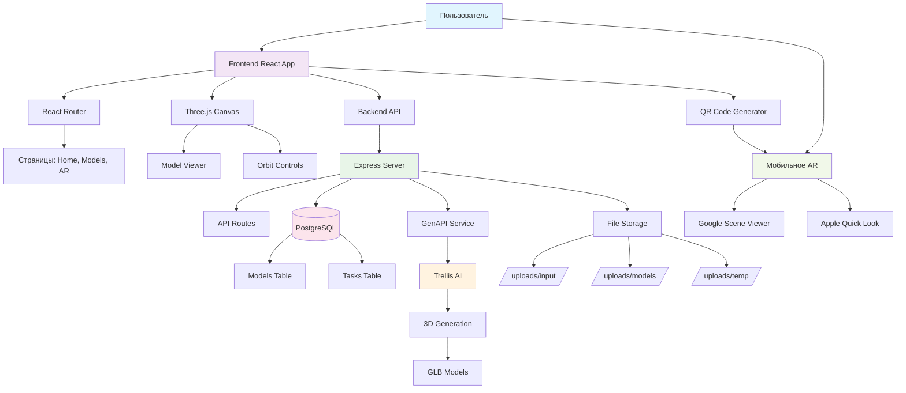
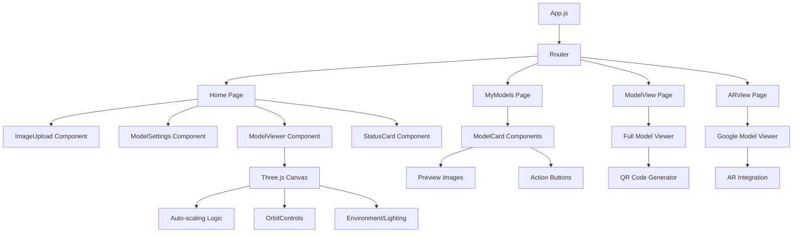

# 🏗️ Архитектура системы - Photo to 3D v3.0

## 📋 Содержание

1. [Общая архитектура](#общая-архитектура)
2. [Backend архитектура](#backend-архитектура)
3. [Frontend архитектура](#frontend-архитектура)
4. [База данных](#база-данных)
5. [AI интеграция](#ai-интеграция)
6. [3D обработка](#3d-обработка)
7. [AR интеграция](#ar-интеграция)
8. [Безопасность](#безопасность)
9. [Производительность](#производительность)

---

## 🎯 Общая архитектура

### Системная архитектура



### Компоненты системы

| Компонент | Технология | Ответственность |
|-----------|------------|-----------------|
| **Frontend** | React 18 + Three.js | UI, 3D визуализация, AR |
| **Backend** | Node.js + Express | API, бизнес-логика, файлы |
| **Database** | PostgreSQL | Хранение моделей и метаданных |
| **AI Engine** | GenAPI + Trellis | Генерация 3D из изображений |
| **3D Processing** | Three.js + GLB | Обработка и отображение 3D |
| **AR** | Model Viewer API | AR на мобильных устройствах |

---

## 🔧 Backend архитектура

### Структура backend

```
backend/
├── 📁 config/              # Конфигурации
│   └── database.js        # PostgreSQL + Sequelize
├── 📁 models/             # Sequelize модели
│   └── Model3D.js         # 3D модель данных
├── 📁 routes/             # API эндпоинты
│   ├── generation.js      # Генерация моделей
│   ├── models.js          # Управление моделями
│   └── users.js           # Пользователи (заготовка)
├── 📁 services/           # Бизнес-логика
│   ├── genapi.js          # GenAPI интеграция
│   └── glb-scaler.js      # Масштабирование GLB
├── 📁 middleware/         # Express middleware
│   └── auth.js            # Аутентификация (заготовка)
├── 📁 uploads/            # Файлы пользователей
│   ├── input/             # Исходные изображения
│   ├── models/            # 3D модели (если не в БД)
│   └── temp/              # Временные файлы
├── server.js              # Главный сервер
└── package.json
```

### API слои

#### 1. Презентационный слой (Routes)
```javascript
// routes/generation.js
const express = require('express');
const router = express.Router();
const { uploadImage, checkStatus, downloadResult } = require('../services/generationService');

// Загрузка и генерация
router.post('/upload', upload.single('image'), async (req, res) => {
  try {
    const { dimensions } = req.body;
    const result = await uploadImage(req.file, { dimensions: JSON.parse(dimensions || '{}') });
    res.json({ success: true, taskId: result.taskId });
  } catch (error) {
    res.status(500).json({ error: error.message });
  }
});
```

#### 2. Бизнес-логика слой (Services)
```javascript
// services/generationService.js
const genapiService = require('./genapi');
const Model3D = require('../models/Model3D');

class GenerationService {
  async uploadImage(file, options = {}) {
    // 1. Сохраняем файл локально
    const imagePath = saveImageLocally(file);

    // 2. Отправляем в GenAPI
    const response = await genapiService.generate3DModel(imagePath, options);

    // 3. Создаем задачу в БД
    const task = await Task.create({
      taskId: response.id,
      status: 'processing',
      imagePath: imagePath,
      options: options
    });

    return { taskId: response.id };
  }

  async checkStatus(taskId) {
    const task = await Task.findByTaskId(taskId);

    if (task.status === 'completed') {
      return task;
    }

    // Проверяем статус в GenAPI
    const status = await genapiService.checkTaskStatus(taskId);

    if (status.status === 'success') {
      await this.completeTask(task, status);
    }

    return { ...task, status: status.status };
  }
}
```

#### 3. Доступ к данным (Models)
```javascript
// models/Task.js
const { DataTypes } = require('sequelize');

const Task = sequelize.define('Task', {
  id: {
    type: DataTypes.UUID,
    primaryKey: true,
    defaultValue: DataTypes.UUIDV4
  },
  taskId: {
    type: DataTypes.STRING,
    allowNull: false,
    unique: true
  },
  status: {
    type: DataTypes.ENUM('processing', 'completed', 'failed', 'timeout'),
    defaultValue: 'processing'
  },
  imagePath: {
    type: DataTypes.STRING,
    allowNull: false
  },
  result: {
    type: DataTypes.JSONB,
    allowNull: true
  }
}, {
  indexes: [
    { fields: ['taskId'], unique: true },
    { fields: ['status'] },
    { fields: ['createdAt'] }
  ]
});
```

### Асинхронная обработка

**Long-polling для отслеживания задач:**

```javascript
// routes/generation.js
router.get('/status/:taskId', async (req, res) => {
  const { taskId } = req.params;

  try {
    // Проверяем задачу в БД
    let task = await Task.findOne({ where: { taskId } });

    if (!task) {
      return res.status(404).json({ error: 'Задача не найдена' });
    }

    // Если задача завершена - сразу возвращаем
    if (task.status === 'completed' || task.status === 'failed') {
      return res.json({
        success: true,
        task: {
          id: task.taskId,
          status: task.status,
          result: task.result,
          error: task.error,
          createdAt: task.createdAt
        }
      });
    }

    // Проверяем статус в GenAPI
    const genapiStatus = await genapiService.checkTaskStatus(taskId);

    if (genapiStatus.status === 'success') {
      // Задача завершена - сохраняем результат
      await completeTask(task, genapiStatus);

      return res.json({
        success: true,
        task: {
          id: task.taskId,
          status: 'completed',
          result: task.result,
          createdAt: task.createdAt
        }
      });
    }

    // Задача еще в процессе
    res.json({
      success: true,
      task: {
        id: task.taskId,
        status: 'processing',
        progress: genapiStatus.progress || 0,
        message: 'Генерация в процессе...',
        createdAt: task.createdAt
      }
    });

  } catch (error) {
    console.error('Ошибка проверки статуса:', error);
    res.status(500).json({ error: error.message });
  }
});
```

---

## 🎨 Frontend архитектура

### Компонентная архитектура



### Основные компоненты

#### ModelViewer - 3D просмотрщик

**Автоматическое масштабирование:**

```javascript
// components/ModelViewer.js
function Model({ url, onComputed }) {
  const { scene } = useGLTF(url);
  const computedRef = useRef(false);

  useLayoutEffect(() => {
    if (!scene || computedRef.current) return;

    // 1. Вычисляем bounding box
    const box = new THREE.Box3().setFromObject(scene);
    const size = new THREE.Vector3();
    const center = new THREE.Vector3();
    box.getSize(size);
    box.getCenter(center);

    // 2. Центрируем модель
    scene.position.sub(center);

    // 3. Нормализуем масштаб
    const maxDimension = Math.max(size.x, size.y, size.z) || 1;
    const targetSize = 0.7; // Целевой размер (влезает в окно)
    const uniformScale = targetSize / maxDimension;
    scene.scale.setScalar(uniformScale);

    // 4. Пересчитываем для камеры
    const fittedBox = new THREE.Box3().setFromObject(scene);
    const sphere = new THREE.Sphere();
    fittedBox.getBoundingSphere(sphere);

    // 5. Передаем радиус для настройки камеры
    onComputed?.(sphere.radius);
    computedRef.current = true;
  }, [scene, onComputed]);

  return <primitive object={scene} />;
}
```

**Адаптивная камера:**

```javascript
function FitCamera({ radius }) {
  const { camera } = useThree();

  useEffect(() => {
    if (!radius) return;

    // Вычисляем расстояние камеры
    const fovRadians = (camera.fov * Math.PI) / 180;
    const distance = (radius / Math.sin(fovRadians / 2)) * 3.0;

    // Настраиваем камеру
    camera.near = Math.max(distance / 100, 0.01);
    camera.far = Math.max(distance * 100, camera.near + 1);
    camera.position.set(0, 0, distance);
    camera.updateProjectionMatrix();
  }, [radius, camera]);

  return null;
}
```

#### State Management

**Глобальное состояние:**

```javascript
// hooks/useAppState.js
import { createContext, useContext, useReducer } from 'react';

const AppStateContext = createContext();

const initialState = {
  user: null,
  models: [],
  currentModel: null,
  loading: false,
  error: null
};

function appReducer(state, action) {
  switch (action.type) {
    case 'SET_LOADING':
      return { ...state, loading: action.payload };
    case 'SET_ERROR':
      return { ...state, error: action.payload };
    case 'SET_MODELS':
      return { ...state, models: action.payload };
    case 'ADD_MODEL':
      return { ...state, models: [...state.models, action.payload] };
    case 'UPDATE_MODEL':
      return {
        ...state,
        models: state.models.map(model =>
          model.id === action.payload.id ? action.payload : model
        )
      };
    default:
      return state;
  }
}

export const AppStateProvider = ({ children }) => {
  const [state, dispatch] = useReducer(appReducer, initialState);

  return (
    <AppStateContext.Provider value={{ state, dispatch }}>
      {children}
    </AppStateContext.Provider>
  );
};

export const useAppState = () => useContext(AppStateContext);
```

#### API интеграция

**HTTP клиент с перехватчиками:**

```javascript
// services/api.js
class APIService {
  constructor() {
    this.baseURL = process.env.REACT_APP_BACKEND_URL || window.location.origin;
  }

  async request(endpoint, options = {}) {
    const url = `${this.baseURL}${endpoint}`;
    const config = {
      headers: {
        'Content-Type': 'application/json',
        ...options.headers
      },
      ...options
    };

    try {
      const response = await fetch(url, config);

      if (!response.ok) {
        throw new Error(`HTTP ${response.status}: ${response.statusText}`);
      }

      return await response.json();
    } catch (error) {
      console.error(`API Error (${endpoint}):`, error);
      throw error;
    }
  }

  // Генерация модели
  async generateModel(imageFile, settings = {}) {
    const formData = new FormData();
    formData.append('image', imageFile);

    if (settings.dimensions) {
      formData.append('dimensions', JSON.stringify(settings.dimensions));
    }

    if (settings.name) {
      formData.append('name', settings.name);
    }

    return this.request('/api/generation/upload', {
      method: 'POST',
      body: formData,
      headers: {}
    });
  }

  // Получение моделей с пагинацией
  async getModels({ page = 1, limit = 20, status = null } = {}) {
    const params = new URLSearchParams({
      page: page.toString(),
      limit: limit.toString()
    });

    if (status) {
      params.append('status', status);
    }

    return this.request(`/api/models?${params}`);
  }

  // Скачивание модели
  async downloadModel(model) {
    const response = await fetch(`${this.baseURL}${model.modelUrl}`);

    if (!response.ok) {
      throw new Error('Failed to download model');
    }

    const blob = await response.blob();
    const url = window.URL.createObjectURL(blob);

    // Создание ссылки для скачивания
    const a = document.createElement('a');
    a.href = url;
    a.download = `${model.name || 'model'}.glb`;
    document.body.appendChild(a);
    a.click();
    document.body.removeChild(a);
    window.URL.revokeObjectURL(url);
  }
}

export const apiService = new APIService();
```

---

## 🗄️ База данных

### PostgreSQL архитектура

```sql
-- Основная таблица моделей
CREATE TABLE models_3d (
    id UUID PRIMARY KEY DEFAULT gen_random_uuid(),
    name VARCHAR(255) NOT NULL DEFAULT 'Untitled Model',
    description TEXT,
    model_url TEXT NOT NULL,
    glb_file BYTEA,  -- BLOB для хранения GLB файлов
    preview_image_url TEXT,
    original_image_url TEXT,
    dimensions JSONB,  -- {"length": 200, "width": 100, "height": 90, "unit": "cm"}
    task_id VARCHAR(255) UNIQUE,
    status VARCHAR(50) DEFAULT 'active' CHECK (status IN ('active', 'archived', 'deleted')),
    metadata JSONB,  -- {"generationParams": {...}, "customData": "..."}
    user_id UUID,
    created_at TIMESTAMP WITH TIME ZONE DEFAULT CURRENT_TIMESTAMP,
    updated_at TIMESTAMP WITH TIME ZONE DEFAULT CURRENT_TIMESTAMP
);

-- Индексы для производительности
CREATE INDEX CONCURRENTLY idx_models_3d_user_id ON models_3d(user_id);
CREATE INDEX CONCURRENTLY idx_models_3d_status ON models_3d(status);
CREATE INDEX CONCURRENTLY idx_models_3d_created_at ON models_3d(created_at DESC);
CREATE INDEX CONCURRENTLY idx_models_3d_task_id ON models_3d(task_id) WHERE task_id IS NOT NULL;
CREATE INDEX CONCURRENTLY idx_models_3d_name_search ON models_3d USING gin(to_tsvector('russian', name));

-- Задачи генерации
CREATE TABLE generation_tasks (
    id UUID PRIMARY KEY DEFAULT gen_random_uuid(),
    task_id VARCHAR(255) NOT NULL UNIQUE,
    status VARCHAR(50) DEFAULT 'processing' CHECK (status IN ('processing', 'completed', 'failed', 'timeout')),
    image_path TEXT NOT NULL,
    options JSONB,
    result JSONB,
    error_message TEXT,
    created_at TIMESTAMP WITH TIME ZONE DEFAULT CURRENT_TIMESTAMP,
    updated_at TIMESTAMP WITH TIME ZONE DEFAULT CURRENT_TIMESTAMP
);

-- Индексы для задач
CREATE INDEX CONCURRENTLY idx_tasks_task_id ON generation_tasks(task_id);
CREATE INDEX CONCURRENTLY idx_tasks_status ON generation_tasks(status);
CREATE INDEX CONCURRENTLY idx_tasks_created_at ON generation_tasks(created_at DESC);
```

### Sequelize модели

**Модель Model3D с виртуальными полями:**

```javascript
// models/Model3D.js
const { DataTypes } = require('sequelize');
const { sequelize } = require('../config/database');

const Model3D = sequelize.define('Model3D', {
  id: {
    type: DataTypes.UUID,
    defaultValue: DataTypes.UUIDV4,
    primaryKey: true
  },
  name: {
    type: DataTypes.STRING,
    allowNull: false,
    defaultValue: 'Untitled Model',
    validate: {
      len: [1, 255]
    }
  },
  description: {
    type: DataTypes.TEXT,
    allowNull: true,
    validate: {
      len: [0, 2000]
    }
  },
  modelUrl: {
    type: DataTypes.STRING,
    allowNull: false,
    comment: 'URL для скачивания GLB файла'
  },
  glbFile: {
    type: DataTypes.BLOB('long'), // PostgreSQL BYTEA
    allowNull: true,
    comment: 'Бинарный GLB файл (до 4GB)'
  },
  previewImageUrl: {
    type: DataTypes.STRING,
    allowNull: true,
    comment: 'URL превью изображения'
  },
  originalImageUrl: {
    type: DataTypes.STRING,
    allowNull: true,
    comment: 'URL исходного изображения'
  },
  dimensions: {
    type: DataTypes.JSONB,
    allowNull: true,
    comment: 'Реальные размеры: {length, width, height, unit}',
    validate: {
      isValidDimensions(value) {
        if (value && (!value.length || !value.width || !value.height)) {
          throw new Error('Dimensions must include length, width, and height');
        }
      }
    }
  },
  taskId: {
    type: DataTypes.STRING,
    allowNull: true,
    unique: true,
    comment: 'ID задачи генерации в GenAPI'
  },
  status: {
    type: DataTypes.ENUM('active', 'archived', 'deleted'),
    defaultValue: 'active',
    allowNull: false
  },
  metadata: {
    type: DataTypes.JSONB,
    allowNull: true,
    defaultValue: {},
    comment: 'Дополнительные метаданные'
  },
  userId: {
    type: DataTypes.UUID,
    allowNull: true,
    comment: 'ID пользователя (для будущей авторизации)'
  }
}, {
  tableName: 'models_3d',
  timestamps: true,
  indexes: [
    {
      fields: ['userId'],
      name: 'idx_models_user_id'
    },
    {
      fields: ['status'],
      name: 'idx_models_status'
    },
    {
      fields: ['createdAt'],
      name: 'idx_models_created_at'
    },
    {
      fields: ['taskId'],
      unique: true,
      where: {
        taskId: {
          [sequelize.Sequelize.Op.ne]: null
        }
      },
      name: 'idx_models_task_id_unique'
    }
  ]
});

// Виртуальные поля
Model3D.prototype.getFileSize = function() {
  return this.glbFile ? this.glbFile.length : 0;
};

Model3D.prototype.getFormattedDimensions = function() {
  if (!this.dimensions) return null;
  const { length, width, height, unit } = this.dimensions;
  return `${length} × ${width} × ${height} ${unit}`;
};

Model3D.prototype.getFileSizeFormatted = function() {
  const bytes = this.getFileSize();
  const mb = bytes / (1024 * 1024);
  return `${mb.toFixed(2)} MB`;
};

// Связи (для будущего)
Model3D.associate = (models) => {
  // Model3D.belongsTo(models.User, { foreignKey: 'userId' });
  // Model3D.hasMany(models.GenerationTask, { foreignKey: 'modelId' });
};

module.exports = Model3D;
```

---

## 🤖 AI интеграция

### GenAPI интеграция

**Сервис для работы с GenAPI:**

```javascript
// services/genapi.js
const axios = require('axios');
const fs = require('fs-extra');
const path = require('path');
const FormData = require('form-data');

class GenAPIService {
  constructor() {
    this.apiKey = process.env.GENAPI_API_KEY?.trim();
    this.baseURL = process.env.GENAPI_BASE_URL || 'https://gen-api.ru/api/v1';

    if (!this.apiKey) {
      throw new Error('GENAPI_API_KEY не установлен');
    }
  }

  // Генерация 3D модели через Trellis
  async generate3DModel(imagePath, options = {}) {
    try {
      // Проверка файла
      if (!await fs.pathExists(imagePath)) {
        throw new Error(`Файл не существует: ${imagePath}`);
      }

      console.log('🎨 Генерация 3D модели с параметрами:', options);

      // Создание FormData
      const formData = new FormData();

      // Определение типа файла
      const ext = path.extname(imagePath).toLowerCase();
      const contentType = {
        '.jpg': 'image/jpeg',
        '.jpeg': 'image/jpeg',
        '.png': 'image/png',
        '.gif': 'image/gif',
        '.webp': 'image/webp'
      }[ext] || 'image/jpeg';

      // Добавление файла
      const fileStream = fs.createReadStream(imagePath);
      formData.append('image_url', fileStream, {
        filename: path.basename(imagePath),
        contentType: contentType
      });

      // Добавление параметров
      Object.entries(options).forEach(([key, value]) => {
        if (value !== undefined && value !== null) {
          formData.append(key, value.toString());
        }
      });

      // API запрос
      const response = await axios.post(
        'https://api.gen-api.ru/api/v1/networks/trellis',
        formData,
        {
          headers: {
            ...formData.getHeaders(),
            'Authorization': `Bearer ${this.apiKey.trim()}`,
            'Accept': 'application/json'
          },
          timeout: 300000, // 5 минут
          maxContentLength: Infinity,
          maxBodyLength: Infinity,
          onUploadProgress: (progress) => {
            const percent = Math.round((progress.loaded * 100) / progress.total);
            console.log(`📈 Загрузка: ${percent}%`);
          }
        }
      );

      console.log('✅ Ответ GenAPI:', response.status);
      console.log('📄 Данные ответа:', JSON.stringify(response.data, null, 2));

      return response.data;

    } catch (error) {
      console.error('❌ Ошибка генерации:', error.message);
      if (error.response) {
        console.error('📄 Ответ ошибки:', error.response.data);
        console.error('🔍 Статус:', error.response.status);
      }
      throw error;
    }
  }

  // Проверка статуса задачи
  async checkTaskStatus(requestId) {
    try {
      const response = await axios.get(
        `https://api.gen-api.ru/api/v1/request/get/${requestId}`,
        {
          headers: {
            'Authorization': `Bearer ${this.apiKey.trim()}`,
            'Accept': 'application/json'
          }
        }
      );

      return response.data;
    } catch (error) {
      console.error('❌ Ошибка проверки статуса:', error.message);
      throw error;
    }
  }

  // Скачивание результата
  async downloadResult(resultUrl, outputPath) {
    try {
      console.log('📥 Скачивание GLB:', resultUrl);

      const response = await axios.get(resultUrl, {
        responseType: 'stream'
      });

      const writer = fs.createWriteStream(outputPath);
      response.data.pipe(writer);

      return new Promise((resolve, reject) => {
        writer.on('finish', () => {
          const stats = fs.statSync(outputPath);
          console.log(`✅ GLB скачан: ${(stats.size / 1024 / 1024).toFixed(2)} MB`);
          resolve();
        });
        writer.on('error', reject);
      });
    } catch (error) {
      console.error('❌ Ошибка скачивания:', error.message);
      throw error;
    }
  }
}

module.exports = new GenAPIService();
```

### Параметры Trellis модели

**Оптимальные настройки для качества:**

```javascript
const DEFAULT_TRELLIS_PARAMS = {
  // Качество формы (основное)
  ss_guidance_strength: 8.5,    // 0-10, сила наведения на изображение
  ss_sampling_steps: 50,        // 1-50, шаги сэмплирования формы

  // Детализация геометрии
  slat_guidance_strength: 4,    // 0-10, сила SLAT наведения
  slat_sampling_steps: 50,      // 1-50, шаги детализации

  // Оптимизация сетки
  mesh_simplify: 0.98,          // 0-0.98, фактор упрощения (меньше = лучше)
  texture_size: 2048            // 512-2048, разрешение текстур (2K)
};

const QUALITY_PRESETS = {
  draft: {
    ss_sampling_steps: 10,
    slat_sampling_steps: 10,
    mesh_simplify: 0.95,
    texture_size: 512
  },
  standard: {
    ss_sampling_steps: 30,
    slat_sampling_steps: 30,
    mesh_simplify: 0.98,
    texture_size: 1024
  },
  high: DEFAULT_TRELLIS_PARAMS,
  ultra: {
    ss_guidance_strength: 9.5,
    ss_sampling_steps: 50,
    slat_guidance_strength: 6,
    slat_sampling_steps: 50,
    mesh_simplify: 0.99,
    texture_size: 2048
  }
};
```

---

## 🖼️ 3D обработка

### GLB обработка

**Масштабирование GLB файлов:**

```javascript
// services/glb-scaler.js
const fs = require('fs-extra');
const path = require('path');

function scaleGLB(glbBuffer, scaleFactor) {
  try {
    // GLB структура: Header (12) + JSON chunk + Binary chunk
    const header = glbBuffer.slice(0, 12);
    const version = header.readUInt32LE(4);
    const length = header.readUInt32LE(8);

    if (header.readUInt32LE(0) !== 0x46546C67) { // 'glTF'
      throw new Error('Invalid GLB file');
    }

    let jsonChunkLength = 0;
    let jsonChunkType = 0;
    let binaryChunkOffset = 12;

    // Читаем JSON chunk
    jsonChunkLength = glbBuffer.readUInt32LE(binaryChunkOffset);
    jsonChunkType = glbBuffer.readUInt32LE(binaryChunkOffset + 4);

    if (jsonChunkType !== 0x4E4F534A) { // 'JSON'
      throw new Error('Invalid JSON chunk');
    }

    const jsonStart = binaryChunkOffset + 8;
    const jsonEnd = jsonStart + jsonChunkLength;
    const jsonData = JSON.parse(glbBuffer.slice(jsonStart, jsonEnd).toString());

    // Читаем binary chunk
    binaryChunkOffset = jsonEnd;
    const binaryChunkLength = glbBuffer.readUInt32LE(binaryChunkOffset);
    const binaryChunkType = glbBuffer.readUInt32LE(binaryChunkOffset + 4);

    if (binaryChunkType !== 0x004E4942) { // 'BIN'
      throw new Error('Invalid binary chunk');
    }

    const binaryStart = binaryChunkOffset + 8;

    // Масштабируем вершины в binary chunk
    const scaledBuffer = Buffer.alloc(glbBuffer.length);
    glbBuffer.copy(scaledBuffer, 0, 0, binaryStart);

    // Копируем JSON chunk без изменений
    glbBuffer.copy(scaledBuffer, binaryStart - jsonEnd + jsonStart, jsonStart, jsonEnd);

    // Масштабируем вершины
    const vertexStride = 12; // 3 float32 по 4 байта
    const vertexCount = Math.floor(binaryChunkLength / vertexStride);

    console.log(`📐 Масштабируем ${vertexCount} вершин с коэффициентом ${scaleFactor}`);

    for (let i = 0; i < vertexCount; i++) {
      const vertexOffset = binaryStart + (i * vertexStride);

      // Читаем XYZ координаты
      const x = glbBuffer.readFloatLE(vertexOffset);
      const y = glbBuffer.readFloatLE(vertexOffset + 4);
      const z = glbBuffer.readFloatLE(vertexOffset + 8);

      // Масштабируем
      const scaledX = x * scaleFactor;
      const scaledY = y * scaleFactor;
      const scaledZ = z * scaleFactor;

      // Записываем обратно
      scaledBuffer.writeFloatLE(scaledX, vertexOffset);
      scaledBuffer.writeFloatLE(scaledY, vertexOffset + 4);
      scaledBuffer.writeFloatLE(scaledZ, vertexOffset + 8);
    }

    // Обновляем длину binary chunk
    scaledBuffer.writeUInt32LE(binaryChunkLength, binaryChunkOffset);

    // Обновляем общую длину файла
    scaledBuffer.writeUInt32LE(scaledBuffer.length, 8);

    console.log(`✅ GLB масштабирован: ${glbBuffer.length} → ${scaledBuffer.length} байт`);
    return scaledBuffer;

  } catch (error) {
    console.error('❌ Ошибка масштабирования GLB:', error.message);
    throw error;
  }
}

module.exports = { scaleGLB };
```

### Three.js оптимизации

**LOD (Level of Detail):**

```javascript
// components/LODModel.js
import { useGLTF } from '@react-three/drei';
import { LOD, Mesh } from 'three';

function LODModel({ url, position }) {
  const { scene } = useGLTF(url);

  // Создаем LOD уровни
  const lod = new LOD();

  // Высокая детализация (близко)
  const highDetail = scene.clone();
  highDetail.scale.multiplyScalar(1.0);
  lod.addLevel(highDetail, 0);

  // Средняя детализация (среднее расстояние)
  const mediumDetail = scene.clone();
  mediumDetail.scale.multiplyScalar(0.7);
  lod.addLevel(mediumDetail, 10);

  // Низкая детализация (далеко)
  const lowDetail = scene.clone();
  lowDetail.scale.multiplyScalar(0.3);
  lod.addLevel(lowDetail, 50);

  return <primitive object={lod} position={position} />;
}
```

**Texture optimization:**

```javascript
// Оптимизация текстур
const textureLoader = new THREE.TextureLoader();

function optimizeTexture(texturePath) {
  return new Promise((resolve) => {
    textureLoader.load(texturePath, (texture) => {
      // Сжатие текстуры
      texture.generateMipmaps = true;
      texture.minFilter = THREE.LinearMipmapLinearFilter;
      texture.magFilter = THREE.LinearFilter;

      // Сжатие для мобильных
      if (isMobile()) {
        texture.format = THREE.RGB_S3TC_DXT1_Format;
      }

      resolve(texture);
    });
  });
}
```

---

## 📱 AR интеграция

### Google Model Viewer

**AR просмотр на мобильных:**

```javascript
// components/ARViewer.js
import '@google/model-viewer';

const ARViewer = ({ modelUrl, dimensions }) => {
  const handleARStart = () => {
    // Логика запуска AR
    console.log('AR started');
  };

  return (
    <model-viewer
      src={modelUrl}
      ar
      ar-modes="webxr scene-viewer quick-look"
      ar-scale={`${dimensions?.unit === 'mm' ? 'millimeters' : 'meters'}`}
      ar-placement="floor"
      camera-controls
      auto-rotate
      loading="eager"
      style={{
        width: '100%',
        height: '400px',
        backgroundColor: '#f0f0f0'
      }}
      on-ar-status={(event) => {
        console.log('AR Status:', event.detail.status);
      }}
    >
      <div slot="ar-button" style={{ display: 'none' }}>
        {/* Кастомная кнопка AR */}
      </div>
    </model-viewer>
  );
};
```

### QR код генерация

**QR код для мобильного доступа:**

```javascript
// services/qrGenerator.js
import QRCode from 'qrcode';

class QRGenerator {
  static async generateARQR(modelUrl, dimensions) {
    // Создаем URL для AR просмотра
    const arUrl = `${window.location.origin}/ar-view/${modelId}`;

    // Генерируем QR код
    const qrOptions = {
      errorCorrectionLevel: 'M',
      type: 'image/png',
      quality: 0.92,
      margin: 1,
      color: {
        dark: '#000000',
        light: '#FFFFFF'
      },
      width: 256
    };

    try {
      const qrCodeDataURL = await QRCode.toDataURL(arUrl, qrOptions);
      return qrCodeDataURL;
    } catch (error) {
      console.error('Ошибка генерации QR:', error);
      throw error;
    }
  }

  static getARUrl(modelId) {
    return `${window.location.origin}/ar-view/${modelId}`;
  }

  static getMobileARSupport() {
    const isAndroid = /Android/i.test(navigator.userAgent);
    const isIOS = /iPhone|iPad|iPod/i.test(navigator.userAgent);
    const supportsWebXR = 'xr' in navigator;

    return {
      isAndroid,
      isIOS,
      supportsWebXR,
      recommendedViewer: isAndroid ? 'scene-viewer' : 'quick-look'
    };
  }
}

export default QRGenerator;
```

### AR оптимизации

**Форматы для AR:**

```javascript
// Оптимизация модели для AR
function optimizeForAR(glbBuffer) {
  // 1. Проверить размер файла (< 50MB для Scene Viewer)
  if (glbBuffer.length > 50 * 1024 * 1024) {
    throw new Error('Файл слишком большой для AR');
  }

  // 2. Оптимизировать геометрию
  const maxVertices = 100000; // Лимит для мобильных

  // 3. Проверить текстуры (максимум 2048x2048)
  const maxTextureSize = 2048;

  // 4. Добавить AR метаданные
  const arMetadata = {
    arScale: 'auto',
    arPlacement: 'floor',
    arPrompt: 'Place on floor'
  };

  return { glbBuffer, metadata: arMetadata };
}
```

---

## 🔒 Безопасность

### Backend безопасность

**Валидация и санитизация:**

```javascript
// middleware/validation.js
const { body, param, validationResult } = require('express-validator');

const validateModelCreation = [
  body('name')
    .trim()
    .isLength({ min: 1, max: 255 })
    .withMessage('Название должно быть 1-255 символов'),

  body('description')
    .optional()
    .isLength({ max: 2000 })
    .withMessage('Описание не более 2000 символов'),

  body('dimensions')
    .optional()
    .isObject()
    .withMessage('Dimensions должен быть объектом'),

  body('dimensions.length')
    .optional()
    .isFloat({ min: 0.1, max: 10000 })
    .withMessage('Длина должна быть 0.1-10000'),

  body('dimensions.width')
    .optional()
    .isFloat({ min: 0.1, max: 10000 })
    .withMessage('Ширина должна быть 0.1-10000'),

  body('dimensions.height')
    .optional()
    .isFloat({ min: 0.1, max: 10000 })
    .withMessage('Высота должна быть 0.1-10000'),

  body('dimensions.unit')
    .optional()
    .isIn(['mm', 'cm', 'm'])
    .withMessage('Единица измерения: mm, cm, m')
];

const handleValidationErrors = (req, res, next) => {
  const errors = validationResult(req);
  if (!errors.isEmpty()) {
    return res.status(400).json({
      success: false,
      error: 'Ошибка валидации',
      details: errors.array()
    });
  }
  next();
};

module.exports = {
  validateModelCreation,
  handleValidationErrors
};
```

**CORS конфигурация:**

```javascript
// server.js
const corsOptions = {
  origin: function (origin, callback) {
    // Разрешенные домены
    const allowedOrigins = [
      'http://localhost:3000',
      'https://your-domain.com',
      'https://your-app.railway.app'
    ];

    // Разрешить запросы без origin (мобильные приложения)
    if (!origin) return callback(null, true);

    if (allowedOrigins.indexOf(origin) !== -1) {
      callback(null, true);
    } else {
      callback(new Error('Not allowed by CORS'));
    }
  },
  credentials: true,
  methods: ['GET', 'POST', 'PUT', 'DELETE', 'OPTIONS'],
  allowedHeaders: ['Content-Type', 'Authorization', 'X-Requested-With']
};

app.use(cors(corsOptions));
```

**Rate limiting:**

```javascript
// middleware/rateLimiter.js
const rateLimit = require('express-rate-limit');

const createAccountLimiter = rateLimit({
  windowMs: 15 * 60 * 1000, // 15 минут
  max: 5, // максимум 5 запросов на генерацию с IP
  message: {
    error: 'Слишком много запросов на генерацию, попробуйте через 15 минут'
  },
  standardHeaders: true,
  legacyHeaders: false,
  skip: (req) => {
    // Пропустить rate limiting для health checks
    return req.path === '/health' || req.path.startsWith('/api/health');
  }
});

const generalLimiter = rateLimit({
  windowMs: 15 * 60 * 1000,
  max: 100, // общий лимит запросов
  message: {
    error: 'Слишком много запросов, попробуйте позже'
  }
});

module.exports = {
  createAccountLimiter,
  generalLimiter
};
```

### Frontend безопасность

**XSS защита:**

```javascript
// Валидация пользовательского ввода
const sanitizeInput = (input) => {
  // Удаление HTML тегов
  return input.replace(/<[^>]*>/g, '');
};

const validateModelName = (name) => {
  const sanitized = sanitizeInput(name);

  if (sanitized.length < 1 || sanitized.length > 255) {
    throw new Error('Название должно быть 1-255 символов');
  }

  // Проверка на запрещенные символы
  if (/[<>\"'&]/.test(sanitized)) {
    throw new Error('Название содержит запрещенные символы');
  }

  return sanitized;
};
```

**Content Security Policy:**

```html
<!-- public/index.html -->
<meta http-equiv="Content-Security-Policy" content="
  default-src 'self';
  script-src 'self' 'unsafe-inline' 'unsafe-eval';
  style-src 'self' 'unsafe-inline';
  img-src 'self' data: https: blob:;
  model-src 'self' https:;
  connect-src 'self' https://gen-api.ru https://api.gen-api.ru;
  object-src 'none';
  base-uri 'self';
  form-action 'self';
">
```

---

## ⚡ Производительность

### Backend оптимизации

**Database optimization:**

```javascript
// Оптимизированные запросы
const getModelsWithPagination = async (userId, { page = 1, limit = 20, status = 'active' }) => {
  const offset = (page - 1) * limit;

  const { rows, count } = await Model3D.findAndCountAll({
    where: {
      userId,
      status
    },
    attributes: [
      'id', 'name', 'previewImageUrl', 'dimensions',
      'createdAt', 'updatedAt'
      // Исключаем большие поля: glbFile, metadata
    ],
    order: [['createdAt', 'DESC']],
    limit,
    offset,
    include: [] // Минимизируем joins
  });

  return {
    models: rows,
    total: count,
    page,
    totalPages: Math.ceil(count / limit)
  };
};
```

**Кэширование:**

```javascript
// services/cache.js
const NodeCache = require('node-cache');
const cache = new NodeCache({ stdTTL: 300, checkperiod: 60 }); // 5 мин TTL

class CacheService {
  static get(key) {
    return cache.get(key);
  }

  static set(key, value, ttl = 300) {
    return cache.set(key, value, ttl);
  }

  static del(key) {
    return cache.del(key);
  }

  static flush() {
    return cache.flushAll();
  }

  // Специфичные методы для приложения
  static getModel(modelId) {
    return this.get(`model:${modelId}`);
  }

  static setModel(modelId, model) {
    return this.set(`model:${modelId}`, model, 600); // 10 мин
  }

  static getUserModels(userId) {
    return this.get(`user_models:${userId}`);
  }

  static setUserModels(userId, models) {
    return this.set(`user_models:${userId}`, models, 180); // 3 мин
  }
}

module.exports = CacheService;
```

### Frontend оптимизации

**Code splitting:**

```javascript
// App.js - ленивая загрузка страниц
import React, { Suspense, lazy } from 'react';

const Home = lazy(() => import('./pages/Home'));
const MyModels = lazy(() => import('./pages/MyModels'));
const ModelView = lazy(() => import('./pages/ModelView'));
const ARView = lazy(() => import('./pages/ARView'));

function App() {
  return (
    <Router>
      <Suspense fallback={<LoadingSpinner />}>
        <Routes>
          <Route path="/" element={<Home />} />
          <Route path="/my-models" element={<MyModels />} />
          <Route path="/model/:id" element={<ModelView />} />
          <Route path="/ar-view/:id" element={<ARView />} />
        </Routes>
      </Suspense>
    </Router>
  );
}
```

**React оптимизации:**

```javascript
// components/ModelCard.js
import React, { memo, useCallback, useMemo } from 'react';

const ModelCard = memo(({ model, onView, onDownload, onDelete }) => {
  // Мемоизированные обработчики
  const handleView = useCallback(() => {
    onView(model.id);
  }, [onView, model.id]);

  const handleDownload = useCallback(() => {
    onDownload(model);
  }, [onDownload, model]);

  const handleDelete = useCallback(() => {
    onDelete(model.id);
  }, [onDelete, model.id]);

  // Мемоизированные вычисления
  const formattedDate = useMemo(() => {
    return new Date(model.createdAt).toLocaleDateString();
  }, [model.createdAt]);

  const formattedDimensions = useMemo(() => {
    if (!model.dimensions) return null;
    const { length, width, height, unit } = model.dimensions;
    return `${length} × ${width} × ${height} ${unit}`;
  }, [model.dimensions]);

  return (
    <div className="model-card">
      {/* ... компонент ... */}
    </div>
  );
});
```

**Three.js оптимизации:**

```javascript
// components/OptimizedModelViewer.js
import React, { useMemo, useRef } from 'react';
import { Canvas, useFrame } from '@react-three/fiber';
import { useGLTF } from '@react-three/drei';
import * as THREE from 'three';

function OptimizedModel({ url }) {
  const { scene } = useGLTF(url);
  const meshRef = useRef();

  // Оптимизация: клонирование геометрии
  const optimizedScene = useMemo(() => {
    const clonedScene = scene.clone();

    // Обход всех мешей
    clonedScene.traverse((child) => {
      if (child.isMesh) {
        // Включение frustum culling
        child.frustumCulled = true;

        // Оптимизация материалов
        if (child.material) {
          child.material.side = THREE.FrontSide;
          child.material.needsUpdate = true;
        }

        // Слияние геометрии для статичных объектов
        if (child.userData.static) {
          child.geometry = child.geometry.toNonIndexed();
        }
      }
    });

    return clonedScene;
  }, [scene]);

  // Оптимизированная анимация
  useFrame((state) => {
    if (meshRef.current) {
      meshRef.current.rotation.y = state.clock.elapsedTime * 0.1;
    }
  });

  return <primitive ref={meshRef} object={optimizedScene} />;
}

const OptimizedModelViewer = ({ modelUrl }) => {
  return (
    <Canvas
      camera={{ position: [0, 0, 5], fov: 50 }}
      gl={{
        antialias: true,
        alpha: false,
        powerPreference: "high-performance"
      }}
      dpr={[1, 2]} // Адаптивное разрешение
      performance={{ min: 0.5 }} // Ограничение FPS для экономии батареи
    >
      <OptimizedModel url={modelUrl} />
      <OrbitControls
        enablePan={true}
        enableZoom={true}
        enableRotate={true}
        maxPolarAngle={Math.PI / 2}
        minDistance={0.1}
        maxDistance={100}
      />
    </Canvas>
  );
};

export default OptimizedModelViewer;
```

### Мониторинг производительности

**Backend метрики:**

```javascript
// middleware/metrics.js
const client = require('prom-client');

// Создание метрик
const httpRequestDuration = new client.Histogram({
  name: 'http_request_duration_seconds',
  help: 'Duration of HTTP requests in seconds',
  labelNames: ['method', 'route', 'status_code'],
  buckets: [0.1, 0.5, 1, 2, 5, 10]
});

const modelGenerationDuration = new client.Histogram({
  name: 'model_generation_duration_seconds',
  help: 'Time taken to generate a 3D model',
  buckets: [10, 30, 60, 120, 300, 600]
});

const activeConnections = new client.Gauge({
  name: 'active_connections',
  help: 'Number of active connections'
});

// Middleware для сбора метрик
const metricsMiddleware = (req, res, next) => {
  const start = Date.now();
  activeConnections.inc();

  res.on('finish', () => {
    const duration = (Date.now() - start) / 1000;
    activeConnections.dec();

    httpRequestDuration
      .labels(req.method, req.route?.path || req.path, res.statusCode.toString())
      .observe(duration);
  });

  next();
};

module.exports = {
  metricsMiddleware,
  httpRequestDuration,
  modelGenerationDuration,
  activeConnections
};
```

---

*📝 Последнее обновление: 25 октября 2025 | Архитектура версии: 3.0*
